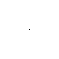
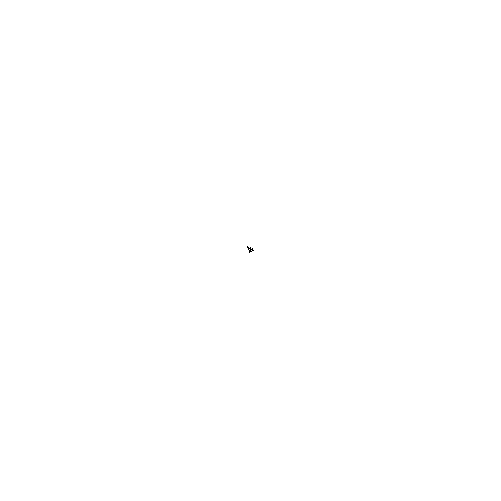

# Diffusion Limited Aggregation Simulation
<i>" "Diffusion" because the particles forming the structure wander around randomly before attaching themselves ("Aggregating") to the structure. "Diffusion-limited" because the particles are considered to be in low concentrations so they don't come in contact with each other and the structure grows one particle at a time rather then by chunks of particles.... "</i> 
reference: http://paulbourke.net/fractals/dla/

Run:
`python dlasimulation.py dimension stickiness drift radius iteration folder_path from_edge frame_count`

Example: ``python dlasimulation.py 501 0.5 2 500 40000 simulation_results/frames false 10 ``

* dimension - (integer) starting from 501. Dimension of Image or Field
* stickiness - (float) between 0 and 1. float) the stickiness factor which determines the probability of a particle aggregating
* drift - (float) greater than 0. the factor of drift towards the structure. Higher the drift more strongly is the attraction to the structure
* radius - (integer) represents the maximum allowed squared distance between 
the particle and the aggregated particles. If particle goes outside the radius of the structure the random walk restarts.
 
 ## Classes
 * [Particle](Particle.py) - A particle object performs the random walk. Assumption -  It can move to any of the 8 neighbouring pixels depending on the direction specified to it. 
    Directions - NorthWest, North, NorthEast, East, SouthEast, South, SouthWest, West
 * [Field](Field.py) - Field / "Image" captures the particle movements and aggregation. The Field object allows certain customizations to the particle movements. Initially the field is empty with one particle at the center.
 * [DlaSimulation](dlasimulation.py) - DlaSimulation simulates the Diffusion Limited Aggregation based on parameters given and captures images of the field at regular intervals. 
 * [BinarySearchTree](BST.py) - The BinarySearchTree class is used to store the aggregated particles in the structure. The root node is the central pixel. This data structure comes in handy to quickly find the nearest particle in the structure to a given particle.
  
 ## Approaches
 |Approach 1 |Approach 2 A| Approach 2 B| Approach 3|
 |:---:|:---:|:---:|:---:|
 |||||
|No drift|Low drift|Higher drift|Drift with optimal start|
 ### Approach 1 - Random walk from edge (Brute force)
  - The particle starts the random walk from the edge pixels
  - The particle moves to any of the four neighbouring pixels with equal probability.
 
 In this case the simulation is extremely slow and is not practical as the probability to reach the center pixel is negligible. The particle jitters around but tends to stay at the same pixel where it was generated.

 ### Approach 2 - Drift towards center from edge pixels
   - The particle starts the random walk from the edge pixels
   - The particle moves randomly but in general drifts towards the center
   
  The simluation is still slow, as most of the time the particle is random walking far from the center.
| |  |
|:---:|:---:|

 ### Approach 3 - Drift towards center from within scope of structure
   - The particle starts from a random pixel at a certain "radius" away from the nearest aggregated particle.
   - The particles also starts at a minimum distance from the aggregated particles
   - The particle moves randomly but in general drifts towards the center
     
   To get the distance from the nearest aggregated particle, a binary search tree (BST) is used to store the aggregated particles in the structure. For a given particle, the BST can get the nearest aggregated particle or the distance to the nearest aggregated particle. This allows the simulation to discard particles outside the radius of the structure.
  
   This enhances the speed of simulation, as the starting pixel of a particle is not too far away.  However the resulting structure does not branch out but rather clumps at the center
   
 [central attractor](simulation_results/sim_1_loop.gif) - stickiness factor = 1, radius = 1000, iterations = 2000, attractor = center
 

 ### Approach 4 - drift towards nearest aggregated particle
   - The particle starts from a random pixel at a certain "radius" away from the nearest aggregated particle.
   - The particles also starts at a minimum distance from the aggregated particles
   - The particle moves randomly but tends to drift towards the nearest aggregated particle in the structure.

  This simulation results in a more natural structure with many organic looking branches. 

  * [stickiness 0.5](simulation_results/sim_14_loop.gif) -  stickiness factor = 0.5, radius = 400, iterations = 10000, attractor = nearest neighbour
 
 
  * [stickiness 0.1](simulation_results/sim_15_loop.gif) -  stickiness factor = 0.1, radius = 300, iterations = 20000, attractor = nearest neighbour
 
 
